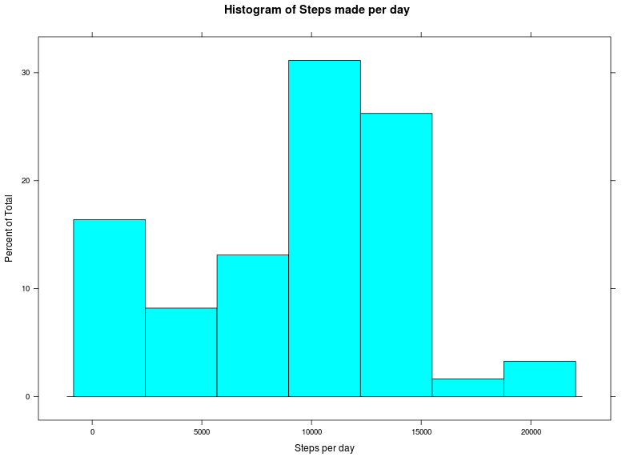
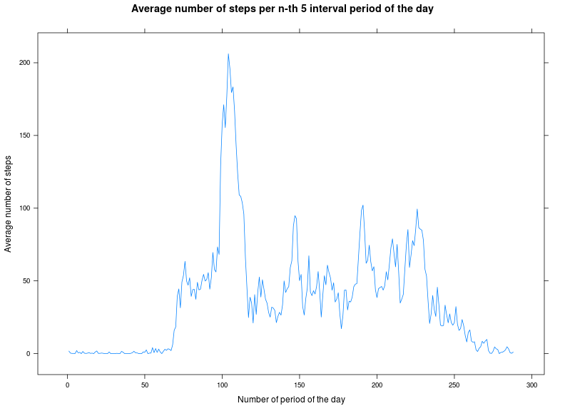
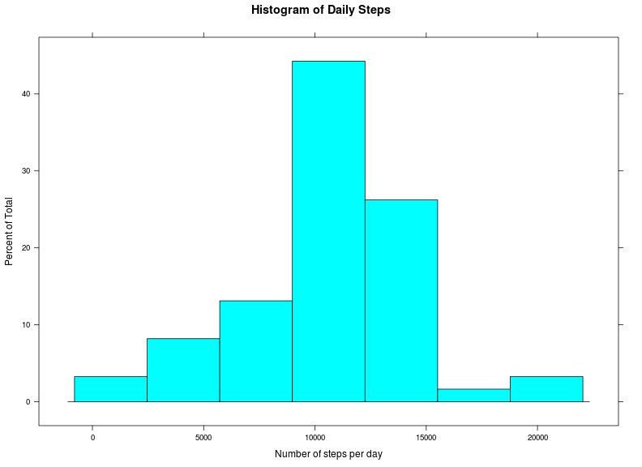
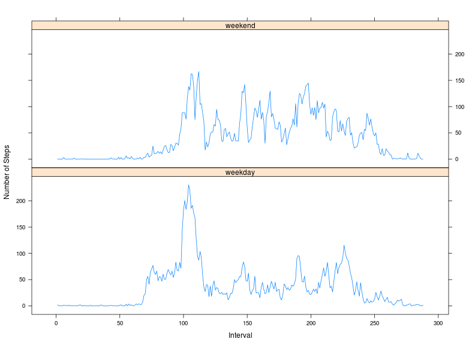

# Reproducible Research: Peer Assessment 1


## Importing libraries. Loading and preprocessing the data

```r
if (!("lattice" %in% installed.packages())) {
    install.packages("lattice")
}
library(lattice)
activity <- read.csv(unz("activity.zip", "activity.csv"), header = T)
activity$date <- as.Date(activity$date, "%Y-%m-%d")
activity$interval <- as.factor(activity$interval)
head(activity, 5)
```

```
##   steps       date interval
## 1    NA 2012-10-01        0
## 2    NA 2012-10-01        5
## 3    NA 2012-10-01       10
## 4    NA 2012-10-01       15
## 5    NA 2012-10-01       20
```


## Visualize the distribution of number of steps per day

```r
# draw histogram
histogram(tapply(activity$steps, activity$date, sum, na.rm = T), xlab = "Steps per day", 
    main = "Histogram of Steps made per day")
```

 

**It looks like there are quite a few days in which very few steps are taken. The
data would not be described well by a normal distribution.**
## What is mean total number of steps taken per day?

```r
# Calculate mean and median steps per day
message(paste("Average steps per day:", round(mean(tapply(activity$steps, activity$date, 
    sum, na.rm = T)), digits = 2)))
```

```
## Average steps per day: 9354.23
```

```r
message(paste("Median steps per day:", round(median(tapply(activity$steps, activity$date, 
    sum, na.rm = T)), digits = 2)))
```

```
## Median steps per day: 10395
```


## What is the average daily activity pattern?

```r
# plot a line of average steps per interval
xyplot(tapply(activity$steps, activity$interval, mean, na.rm = T) ~ as.numeric(unique(activity$interval)), 
    type = "l", xlab = "Number of period of the day", ylab = "Average number of steps", 
    main = "Average number of steps per n-th 5 interval period of the day")
```

 

```r

# find in which period on average the person makes the most steps
max.steps <- max(tapply(activity$steps, activity$interval, mean, na.rm = T))
max.interval <- which(tapply(activity$steps, activity$interval, mean, na.rm = T) %in% 
    max.steps)
message(paste0("The maximum average number of steps was ", round(max.steps, 
    2), " and it occured in interval ", max.interval, "."))
```

```
## The maximum average number of steps was 206.17 and it occured in interval 104.
```

**It is evident from the graph that the person is the most active at 
8:40. It would seem that
maybe the person was going to work at that around time. Activity is dying off
when the 288th (midnight) interval aproaches and is flat in the early hours.**

## Imputing missing values / adding weekend - weekday dimentionality
**The are 2304 NA values in the original dataset. I
substitute the missing values with the average for the interval from the 
original table.
In addition a weekday/weekend factor is added for later comparison of the data.
Average steps per interval given weekday/weekend were also added to the table.**

```r
# make a copy of the original activity table and impute NAs to the period
# average
activity.imp <- activity
activity.imp[is.na(activity.imp$steps), ]$steps <- as.vector(tapply(activity.imp$steps, 
    activity.imp$interval, mean, na.rm = T)[activity.imp[is.na(activity.imp$steps), 
    ]$interval])

# add weekday/weekend factor variable to the new data table
days <- weekdays(as.Date(activity.imp$date, "%Y-%m-%d"))
days[days == "Sunday" | days == "Saturday"] <- "weekend"
days[days != "weekend"] <- "weekday"
activity.imp <- cbind(activity.imp, days)

# create a table to be used for the plot
persdaysmeans <- tapply(activity.imp$steps, list(activity.imp$interval, activity.imp$days), 
    mean)
activity.imp <- cbind(activity.imp, persdaysmeans = vector("numeric", length = dim(activity.imp)[1]))
activity.imp[activity.imp$days == "weekday", 5] <- as.vector(persdaysmeans[activity.imp[activity.imp$days == 
    "weekday", 3], 1])
activity.imp[activity.imp$days == "weekend", 5] <- as.vector(persdaysmeans[activity.imp[activity.imp$days == 
    "weekend", 3], 2])
```


## Visualize the distribution of number of steps per day using the imputed dataset

```r
# draw histogram
histogram(tapply(activity.imp$steps, activity.imp$date, sum), xlab = "Number of steps per day", 
    main = "Histogram of Daily Steps")
```

 

**In comparison to the earlier histogram the data looks much more normally
distributed. This is also evident from the mean - median convergence.**

```r
# calculate mean and median steps per day with new data table
message(paste("Average steps per day:", round(mean(tapply(activity.imp$steps, 
    activity.imp$date, sum)), digits = 2)))
```

```
## Average steps per day: 10766.19
```

```r
message(paste("Median steps per day:", round(median(tapply(activity.imp$steps, 
    activity.imp$date, sum)), digits = 2)))
```

```
## Median steps per day: 10766.19
```


## Are there differences in activity patterns between weekdays and weekends?

```r
# plot and compare the average steps per 5 minute interval between weekends
# and weekdays
with(unique(activity.imp[, 3:5]), xyplot(persdaysmeans ~ as.numeric(interval) | 
    days, type = "l", layout = c(1, 2), xlab = "Interval", ylab = "Number of Steps"))
```

 

**Evidently a weekend day starts a bit later although the person is the most 
active at roughly the same time as a weekday. During the weekend however there is
much more activity throughout the whole day in comparison with a weekday where
activity dies off after the initial spike**
